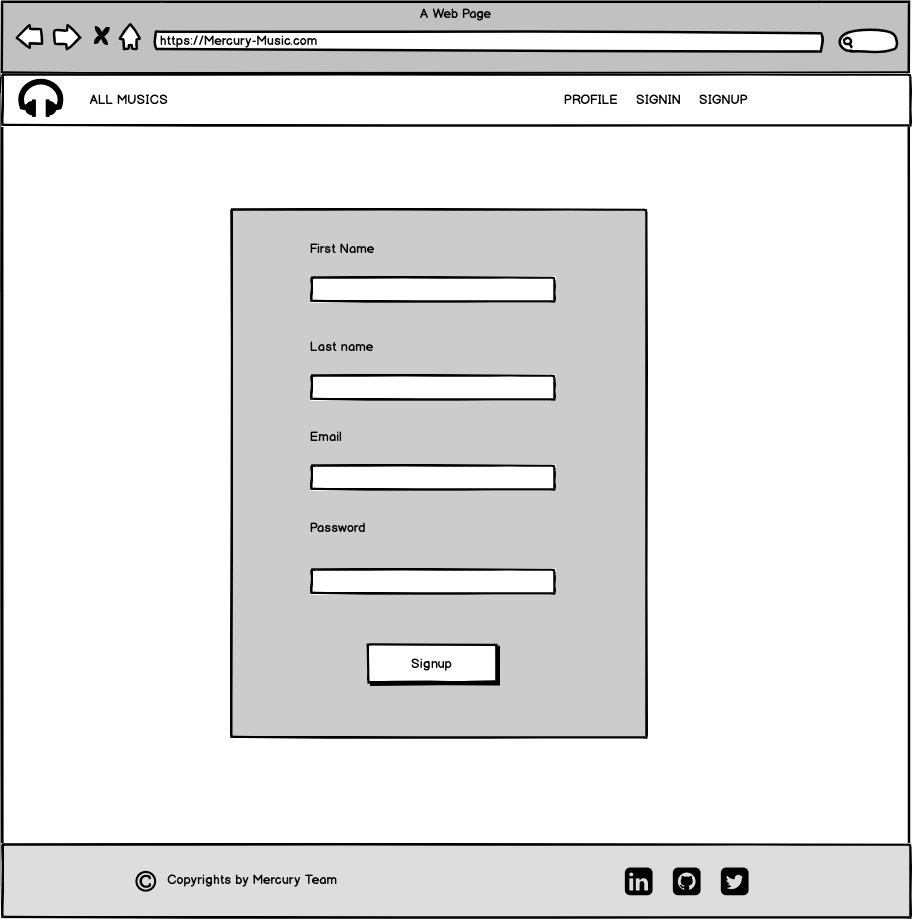
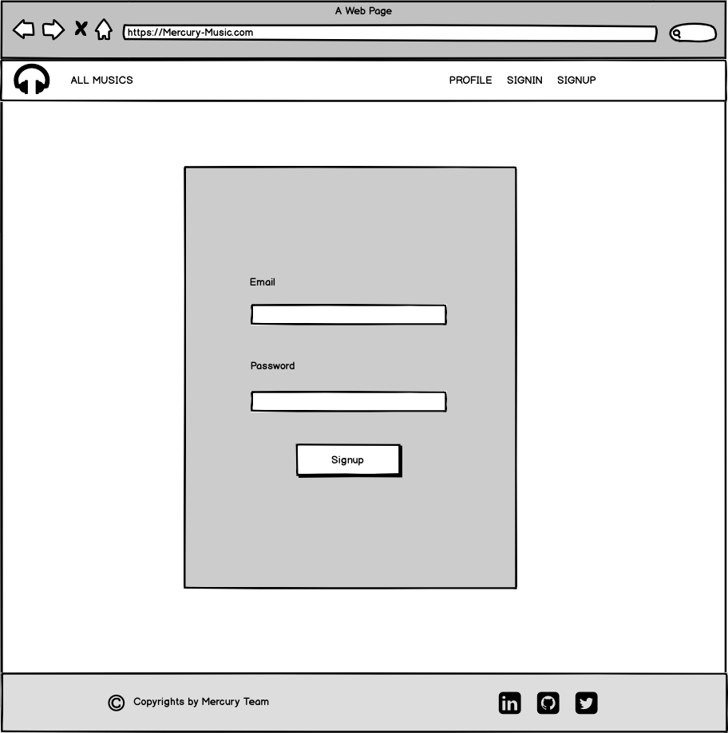
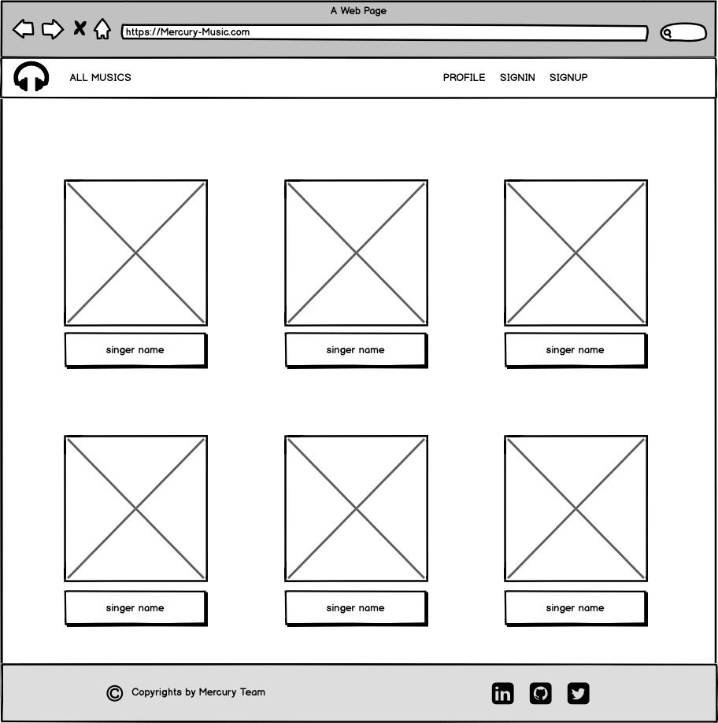
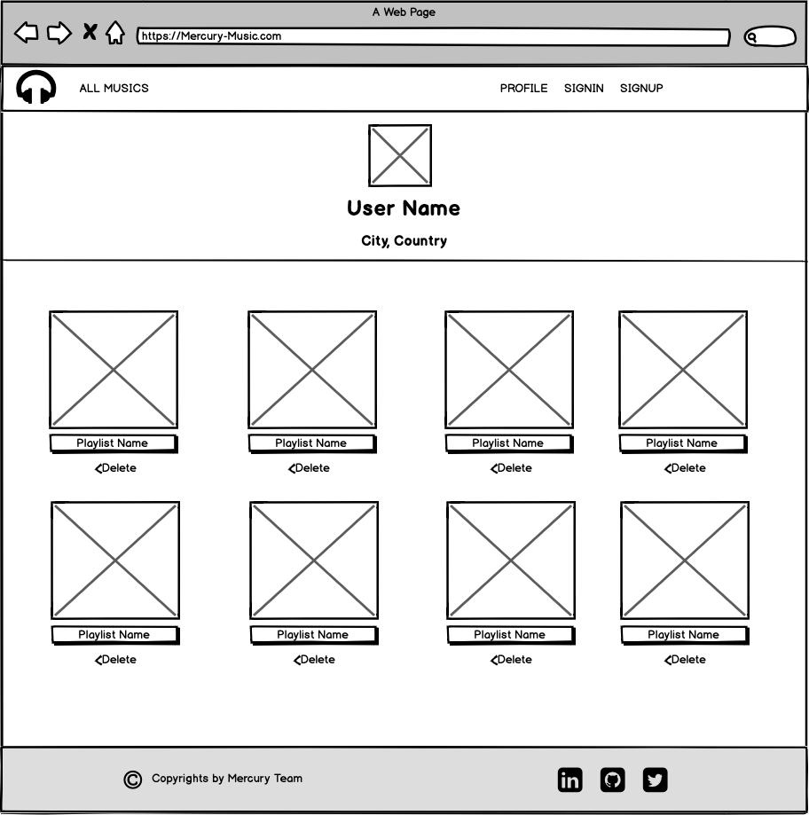

# Mercury-Music

 # Project Overview
Music Library with player allow user to search and listen their favorites musics.

 # Prototype

 # Software Technologies
-React
-API
-Bootstrap
-MongoDB 
-Nodejs

 # User requirements
- User can be able to sign up 
- User can be able to sign in
- User can be able to change password by email
- User can be able to sign out
- User can be able  to search for specific music 
- User can be able to add music for favorite page

# Future work
- Allow users to build own playlists.
- More content classification 
- Admin page
- Allow users to upload musics 

